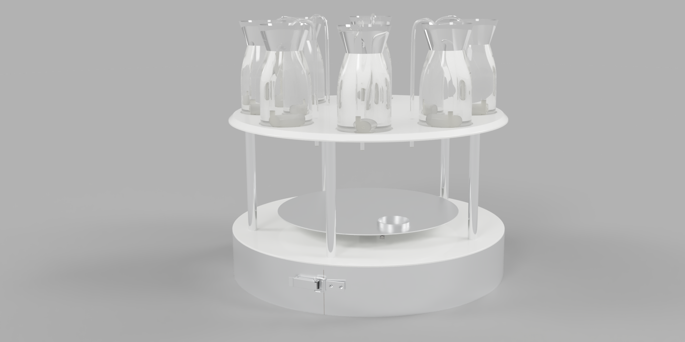
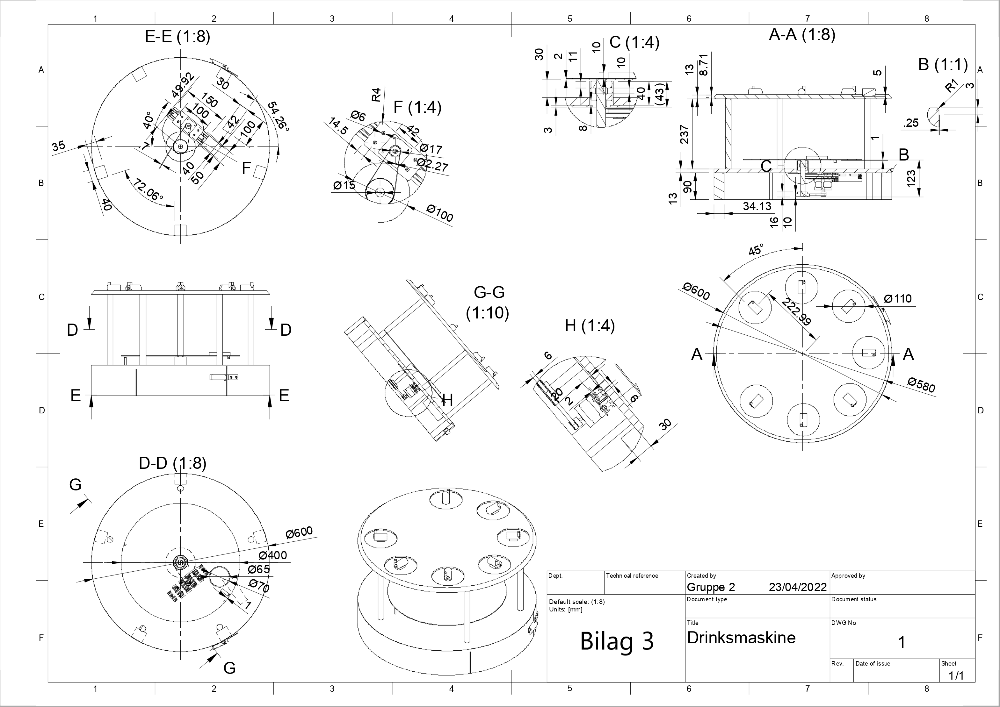

# DrinksRobot ![intro][intro-image] ![lecture][lecture-image] 
A drink making machine.
This machine has been made in gymnasium by me and my studygroup

## General concept
A robot for the automated production of drinks.

## Key features
* Personal selection
* Additional shaking of mixture

## Technical drawing
A technical drawing of the final robot:

[intro-image]: https://img.shields.io/badge/LNG-C++-orange
[lecture-image]: https://img.shields.io/badge/Lecture-Robot_Tech-Blue
